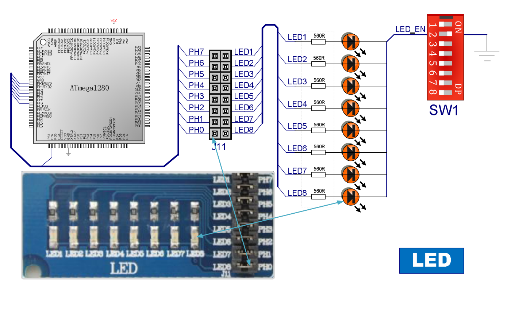
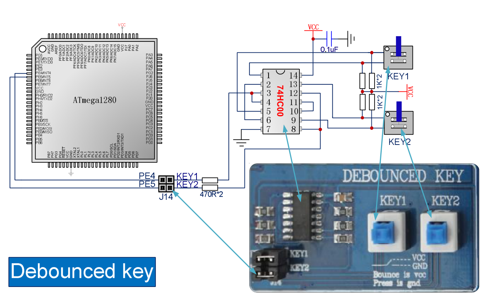

## Before you start:

Make sure the switches are set in the correct state as shown in the diagram, otherwise the specified peripheral won't work correctly or at all.

It is assumed that the reader has some knowledge of port pin configurations.

## LEDs

LEDs are straight forward, they'll light up whenever current is driven through the connected pins.
Since LEDs are connected to Port H, the data direction register (DDRH) will be set to high to set it in output mode.
To turn the LED's on and off, the port's data register (PORTH) can be driven high or low.

## Debounced Key

As indicated in the schematic, upon pressing the button, the connected pin will be driven low, otherwise it will be pulled high.
In order to read the state of the key, the respective pin has to be set as sink by setting DDRE as output and driving the PORT data pin low. The state can then be read using the input data register (PINE).

